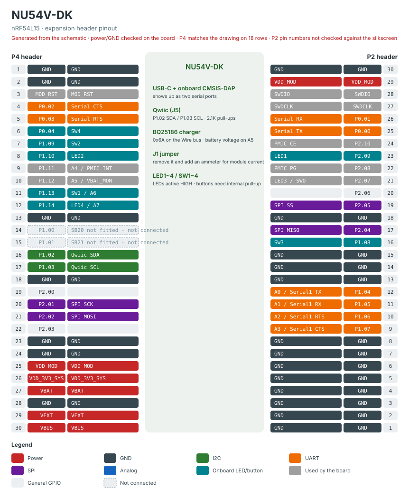

# NU54V-DK (nRF54L15)

**모듈: NCRB54N01VC. 회로도 `NU54_DK_2026-07-13T15_16_09_UTC_SCH.pdf`,
`Variant NU-54DK-C` (2026-07-13 수정) 기준.**

> ⚠ **NU54-DK 와 다른 보드다.** 한동안 variant 를 공유했는데(`nu54dk`),
> 회로도를 확인해 보니 PCB 가 다르다. **2026-09-12 에 `nu54vdk` 로 분리했다.**

---

## 0. NU54-DK 와 무엇이 다른가

| | NU54-DK | **NU54V-DK** |
|---|---|---|
| 칩 | nRF54L05 | **nRF54L15** |
| 디버그 | 외부 프로브 (J3) | **온보드 CMSIS-DAP** |
| USB | CP2102N USB-UART | **USB-C + DAP 겸용** |
| 전원 | AZ1117CR LDO | **BQ25186 배터리 충전 PMIC** |
| 확장 헤더 | 25핀 × 2 (P1/P3) | **30핀 × 2 (P2/P4)** |
| I2C 커넥터 | 없음 | **Qwiic (J5), 2.1K 풀업** |
| 두 번째 UART | 없음 | **있다** (DAP 으로) |

**같은 것**: LED 4개, 버튼 4개, `Serial` 배정. 아래 §1 참조.

---

## 1. LED · 버튼 · `Serial` — NU54-DK 와 동일

| | GPIO |
|---|---|
| LED1 | P2.09 |
| LED2 | P1.10 |
| LED3 | P2.07 (SWO 겸용) |
| LED4 | P1.14 (AIN7 겸용) |
| SW1 | P1.13 (AIN6 겸용) |
| SW2 | P1.09 |
| SW3 | P1.08 |
| SW4 | P0.04 |

LED 는 **active HIGH** (버퍼 + MOSFET 구동). 버튼은 외부 풀업이 없어
`INPUT_PULLUP` 이 필요하다 — 회로도에 `USE INTERNAL PULLUP` 이라고 적혀 있다.

`Serial` = P0.00 TX / P0.01 RX (+ P0.02 RTS / P0.03 CTS), 온보드 DAP 경유.

> 이 배정은 `chcbaram/nu54dk` 의 Zephyr DTS 와도 일치한다 —
> 회로도 좌표 추출과 DTS 두 경로가 독립적으로 같은 값을 냈다.

---

## 2. Qwiic I2C 커넥터 (J5) — `Wire` 가 여기다

```
J5   1 GND   2 VDD_MOD   3 SDA   4 SCL      (Qwiic 표준)
```

| | GPIO | 브리지 |
|---|---|---|
| SDA | **P1.02** | SB14 |
| SCL | **P1.03** | SB15 |

**2.1K 풀업(R29/R30)이 보드에 있다.** 외부 풀업을 달지 마라.

⚠ P1.02 / P1.03 은 칩의 **NFC1 / NFC2 겸용 핀**이다. 이 보드에서는 Qwiic 에
배선돼 있으므로 **NFC 는 쓸 수 없다.** variant 가 `PIN_NFC1/2` 를 정의하지
않는 이유다.

### ⚠⚠ 리셋 직후 이 핀들은 **NFC 패드**라 I2C 가 안 된다

nRF54L 은 NFC 겸용 핀이 **NFC 패드 모드로 부팅한다.** 그 상태로는 GPIO 로도
TWIM 으로도 동작하지 않고, **오류도 로그도 없이 `Wire` 가 아무것도 못 찾는다.**
실제로 이 보드에서 그렇게 한 번 막혔다 — 스캔이 통째로 비었다.

MDK 스타트업(`system_nrf54l.c`)이 꺼 주기는 하지만
`NRF_CONFIG_NFCT_PINS_AS_GPIOS` 가 정의돼 있을 때뿐이고, 우리는 그 전역
빌드 플래그를 쓰지 않는다 (보드에 따라 NFC 를 쓸 수도 있다).

→ **이 보드의 `initVariant()` 가 끈다:**

```c
NRF_NFCT->PADCONFIG = (NFCT_PADCONFIG_ENABLE_Disabled << NFCT_PADCONFIG_ENABLE_Pos);
```

같은 핀을 쓰는 보드를 새로 만들면 **이 줄을 반드시 복사해 가라.**

---

## 3. PMIC — BQ25186, `Wire` 와 같은 버스에 있다

리튬 충전기 **BQ25186** (`VBAT` 입력, `VDD_3V3_SYS` 출력).

**I2C 는 Qwiic 과 같은 버스다** — P1.02 / P1.03 에 **0x6A** 로 붙어 있다.
실기 스캔에서 나란히 잡혔다:

```
I2C scanner
Wire : 0x6A 0x70          <- 0x6A PMIC, 0x70 Qwiic 의 SHTC3
```

⚠ **Qwiic 에 0x6A 를 쓰는 장치를 꽂으면 충돌한다.**

> ⚠ **한동안 이 문서는 PMIC I2C 가 P1.11 / P1.12 에 있다고 적고 있었다. 틀렸다.**
> 회로도에서 PowerBlock 시트 심볼의 포트 이름을 읽지 못해, "P2 에는 TWIM 이
> 닿지 않으니 SCL/SDA 는 P1 둘일 수밖에 없다" 고 추론했다. 추론 자체는
> 논리적이었지만 **전제가 틀렸다** — SB1~SB4 가 잡는 것은 I2C 가 아니었다.
> 실기 스캔 한 번이 뒤집었다.

### `SB1`~`SB4` — 확정됐다

블록도의 PowerBlock 포트 순서(`PMIC_INT` → `PMIC_PG` → `PMIC_CE` → `VBAT_MON`)가
`SB1`~`SB4` 순서와 그대로 이어지고, **실측이 이를 확인한다.**

| 브리지 | GPIO | 신호 | 실측 |
|---|---|---|---|
| SB1 | **P1.11** (= A4) | `PMIC_INT` | digital 1 / 3300 mV — 오픈드레인 + 10K 풀업, 평시 비활성 |
| SB2 | **P2.08** | `PMIC_PG` | digital 0 |
| SB3 | **P2.10** | `PMIC_CE` | digital 0 — 충전 enable. 출력으로 몰 수 있다 |
| SB4 | **P1.12** (= A5) | **`VBAT_MON`** | 2.8 V → 배터리 4.1 V |

I2C 는 이 넷에 없다 — `SB16` / `SB17` 이 `PMIC_SDA` / `PMIC_SCL` 을
**P1.02 / P1.03 에** 붙인다. Qwiic 과 같은 넷이다.

### 배터리 전압 — `A5` 로 직접 읽는다

```
VBAT ─ R8 470K ─┬─ P1.12 (AIN5)
                └─ R11 1M ─ GND
```

분압비 1M/(470K+1M) = **0.680** → `배터리 전압 = 읽은 값 × 1.470`.
variant 가 `PIN_VBAT` / `VBAT_DIVIDER` 로 제공한다 (XIAO 와 같은 이름).

실측 교차 확인: ADC 4.05~4.16 V ↔ 충전기가 "CV, 목표 4.20 V" 로 보고. 일치한다.

⚠ **분압기 출력 임피던스가 320 kΩ** (470K ‖ 1M) 이라 SAADC 기본 획득시간
(10 µs)으로는 값이 낮고 수십 mV 흔들린다. **여러 번 읽어 평균 내라.**
대신 누설이 4.1 V 에서 **2.8 µA** 뿐이라 배터리 구동에 유리한 선택이다.

### 예제 — `libraries/NU54V-DK/examples/`

| | 무엇 | 실기 출력 |
|---|---|---|
| `pmic` | 충전기 상태 전부 — 상태/입력/설정/이상/래치 | `charging - constant voltage` / `limit 500 mA` / `target 4.20 V  charge 10 mA` |
| `battery` | 전압 + 충전 상태를 나란히 | `4.154 V  ~94%  full or disabled  [VIN good]` |
| `dual_serial` | USB 포트 두 개 | 포트별로 `[port 1]` / `[port 2]` 분리 확인 |

**모두 읽기 전용이다.** 충전 설정을 잘못 쓰면 충전이 멎거나 그 이상이 될 수 있다.

⚠ 예제에 `#if` 가드를 두지 않는다. 라이브러리 이름이 보드 이름이므로 다른
보드에서 안 되는 것은 자명하고, 가드를 넣으면 모든 파일이 지저분해진다.
대신 `extras/check_examples.sh` 가 **보드 전용 라이브러리는 그 보드에서만**
빌드하도록 알고 있다 — 제약이 있어야 할 곳은 예제가 아니라 거기다.

⚠ 실측에서 **충전 전류가 10 mA** 로 설정돼 있었다 (입력 제한은 500 mA).
BQ25186 은 1 A 까지 되므로, 충전이 느리다면 여기가 원인이다.

## 4. ⚠ 아날로그 핀이 기본 상태로는 하나도 안 남는다

AIN0~7 은 칩에서 **P1.04~P1.07 / P1.11~P1.14 고정**인데, 이 보드는 여덟 개를
전부 쓰고 있다.

| | GPIO | 쓰는 곳 | 브리지 |
|---|---|---|---|
| A0 | P1.04 | **`Serial1` TX** → DAP | **SB9 (붙어 있음)** |
| A1 | P1.05 | **`Serial1` RX** | **SB10 (붙어 있음)** |
| A2 | P1.06 | Serial1 RTS | **SB11** |
| A3 | P1.07 | Serial1 CTS | **SB12** |
| A4 | P1.11 | `PMIC_INT` | **SB1 (붙어 있음)** |
| A5 | P1.12 | **`VBAT_MON`** — 배터리 전압 | **SB4 (붙어 있음)** |
| A6 | P1.13 | SW1 | — |
| A7 | P1.14 | LED4 | — |

**여덟 개 모두 헤더에 나와 있으므로 해당 브리지를 떼면 쓸 수 있다.**
단 **A5 는 떼지 마라** — 배터리 전압을 읽는 유일한 경로다.
variant 는 Adafruit 호환을 위해 `A0`~`A7` 이름을 그대로 두되, 주석으로 경고한다.

✅ **`SB9`~`SB12` 는 붙어 있다 (실기 확인).** 그래서 호스트에 시리얼 포트가
두 개 잡히고, `analogRead(A0..A3)` 은 DAP 이 물고 있는 레벨을 읽는다. §5 참조.

---

## 5. `Serial1` — 두 번째 UART, USB 포트가 둘인 이유

**호스트에 USB 시리얼 포트가 두 개 잡힌다.** 온보드 DAP 이 CDC 를 둘 노출하고,
MCU 쪽에서 서로 다른 UART 로 간다. 실기에서 확인했다 (2026-09-12):

| 호스트 포트 | 코어 객체 | GPIO | 브리지 |
|---|---|---|---|
| 첫 번째 | `Serial` | P0.00 TX / P0.01 RX | SB5~SB8 |
| 두 번째 | **`Serial1`** | P1.04 TX / P1.05 RX | **SB9~SB12** |

```c
Serial.println("port A");     // 첫 번째 포트로 나온다
Serial1.println("port B");    // 두 번째 포트로 나온다
```

두 포트를 동시에 열어 확인했고, 각각 자기 문자열만 받았다.
**즉 `SB9`~`SB12` 는 붙어 있다.** UARTE20 을 쓴다 (P1 = 도메인 20).

흐름제어선 RTS/CTS 는 P1.06 / P1.07 에 있지만 코어는 쓰지 않는다.

⚠ **대가: A0~A3 를 못 쓴다.** 같은 네 핀이다. `analogRead` 가 필요하면
`SB9`~`SB12` 를 떼야 하고, 그러면 두 번째 포트가 죽는다. 둘 다 헤더에
나와 있으니 선택은 쓰는 사람 몫이다.

## 6. 확장 헤더



> 그림은 아래 표에서 **생성된다** — `extras/gen_pinout_svg.py`.
> 표를 고치면 다시 돌려라. 손으로 SVG 를 고치지 마라.
>
> **전원/GND 는 실물에서 확인했다** (2026-09-12). 도면 텍스트로는 두 전원
> 버스가 갈리지 않아 한동안 비워 두었던 자리다:
> P2 의 1~8 · 13~15 · 18 · 30, P4 의 1 · 2 · 13 · 18 · 23 · 24 · 28 이 GND 다.
>
> ⚠ **P4 의 14 · 15 는 패드만 있고 연결돼 있지 않다** — `SB20`/`SB21` 미실장
> (§7). 그림에 흰 칸으로 표시했다.
>
> 그림의 핀 순서는 **실물 배치를 따른다** — P2 는 1번이 위, **P4 는 30번이 위**다.


> ⚠ 아래 표는 회로도에서 **좌표로 추출**한 것이다. P4 는 도면 이미지와
> 18행 전부 일치해 검증됐고, P2 는 같은 규칙을 적용한 결과다.
> **실물 실크스크린과 대조하지는 않았다.**

### P2 헤더 (30핀)

| 핀 | 이름 | GPIO | | 핀 | 이름 | GPIO |
|---|---|---|---|---|---|---|
| 9 | A3 / Serial1 CTS | P1.07 | | 20 | — | P2.06 |
| 10 | A2 / Serial1 RTS | P1.06 | | 21 | LED3 / SWO | P2.07 |
| 11 | A1 / Serial1 RX | P1.05 | | 22 | PMIC PG | P2.08 |
| 12 | A0 / Serial1 TX | P1.04 | | 23 | LED1 | P2.09 |
| 16 | SW3 | P1.08 | | 24 | PMIC CE | P2.10 |
| 17 | SPI MISO | P2.04 | | 25 | Serial TX | P0.00 |
| 19 | SPI SS | P2.05 | | 26 | Serial RX | P0.01 |

표에 없는 번호: **1~8 · 13~15 · 18 · 30 = GND**, 29 = `VDD_MOD`,
27 = `SWDCLK`, 28 = `SWDIO`.

### P4 헤더 (30핀)

| 핀 | 이름 | GPIO | | 핀 | 이름 | GPIO |
|---|---|---|---|---|---|---|
| 4 | Serial CTS | P0.02 | | 12 | LED4 / A7 | P1.14 |
| 5 | Serial RTS | P0.03 | | 16 | Qwiic SDA | P1.02 |
| 6 | SW4 | P0.04 | | 17 | Qwiic SCL | P1.03 |
| 7 | SW2 | P1.09 | | 19 | — | P2.00 |
| 8 | LED2 | P1.10 | | 20 | SPI SCK | P2.01 |
| 9 | A4 / PMIC INT | P1.11 | | 21 | SPI MOSI | P2.02 |
| 10 | A5 / VBAT_MON | P1.12 | | 22 | — | P2.03 |
| 11 | SW1 / A6 | P1.13 | | | | |

3 = `MOD_RST`, **1 · 2 · 13 · 18 · 23 · 24 · 28 = GND**,
25 = `VDD_MOD`, 26 = `VDD_3V3_SYS`(3.3V 출력), 27 = `VBAT`, 29 = `VEXT`,
30 = `VBUS`(5~14V 입력).

⚠ **P4 의 14 · 15번(P1.00 / P1.01)은 실제로는 연결돼 있지 않다.** 그 핀들이
헤더로 나가려면 `SB20` / `SB21` 이 붙어야 하는데 **실물에서 미실장으로 확인했다**
(2026-09-12). 도면에는 패드가 있으니 표에는 남겨 두되 취소선으로 표시했다.
§7 참조.

---

## 7. 클럭 — 크리스털이 고정 배선이다

32.768 kHz 크리스털 Y1 이 P1.00(XL1) / P1.01(XL2) 에 실장돼 있고 로드 캡
C1/C2 = 13 pF 가 있다. → `USE_LFXO`.

브리지 네 개가 이 두 핀의 행선지를 정한다:

| | 무엇 | 실물 |
|---|---|---|
| `SB18` / `SB19` | P1.00 / P1.01 ↔ **크리스털** | 붙어 있다 (BLE 가 동작하므로) |
| `SB20` / `SB21` | P1.00 / P1.01 ↔ **P4 헤더** | **미실장 (확인함)** |

→ **P1.00 / P1.01 은 GPIO 로 쓸 수 없고 헤더에도 나오지 않는다.**
variant 의 핀맵에서 둘 다 `NRF54L_PIN_NC` 로 막혀 있다.

⚠ 반대로 `SB20`/`SB21` 을 붙이고 `SB18`/`SB19` 를 떼면 크리스털이 끊긴다.
그러면 `USE_LFRC` 로 빌드해야 하고 **BLE 에는 쓸 수 없다**
(정확도가 +9000 ppm — CLAUDE.md §7 F12).

## 8. ⚠ `J1` — 전류 측정 점퍼

**LDO 출력과 모듈 전원 사이에 2핀 헤더가 직렬로 들어가 있다.**

```
VSYS ─ U1 (TPS7A3701) ─ VDD_3V3_SYS ─[ J1 ]─ VDD_MOD ─ 모듈
```

| | |
|---|---|
| 점퍼 꽂음 (기본) | 정상 동작 |
| 점퍼 빼고 두 핀에 전류계 | **모듈 레일의 소비 전류만** 측정 |

LDO 는 `R5` 52.3K / `R6` 30.1K 피드백이라 약 **3.3 V** (P4 26번의 `3.3V OUT`).

**M1 의 마지막 미완 항목이 전류 측정이다** (CLAUDE.md, 프로브 분리 상태 — §7 F8).
이 보드는 그걸 위한 헤더를 달고 나왔으므로 여기서 재면 된다.
배치도 좋다 — **DAP(`VDD_3V3_DAP`)과 PMIC·충전 LED 는 J1 앞단**이라 섞이지 않는다.

⚠ 다만 `VDD_MOD` 는 MCU 전용이 아니다. 아래도 같이 물려 있다:

- **Qwiic 커넥터 J5-2** — 꽂아 둔 센서가 같이 측정된다
- Qwiic 풀업 `R29`/`R30` (버스가 LOW 일 때만)
- LED 버퍼 `U8`/`U9` 의 VCC, 리셋 풀업 `R39`

**µA 를 다툴 때는 Qwiic 을 빼고 재라.**

---

## 9. 아직 확인 안 된 것

- [ ] P2 헤더 핀 번호를 실물 실크스크린과 대조 (P4 는 도면 이미지로 검증됨)
- [x] `SB5`~`SB8` — `Serial` 이 동작하므로 붙어 있다


- [ ] `J1` 을 빼고 실제 소비 전류 측정 (M1 마감 항목)
- [ ] 전원 시트의 LED `D3`/`D5` 가 배터리 구동 시에도 켜지는지 — 상시 점등이면
      1 kΩ 기준 ~2 mA 라 위의 µA 설계가 무의미해진다

**확인된 것**: `SB1`~`SB4` 붙어 있고 각각 INT/PG/CE/VBAT_MON 으로 확정,
`SB20`/`SB21` 미실장(크리스털 고정),
`SB14`/`SB15` 붙어 있음(Qwiic 이 실기에서 동작), `SB9`~`SB12` 붙어 있음(`Serial1`),
PMIC 는 `Wire` 버스의 0x6A.
